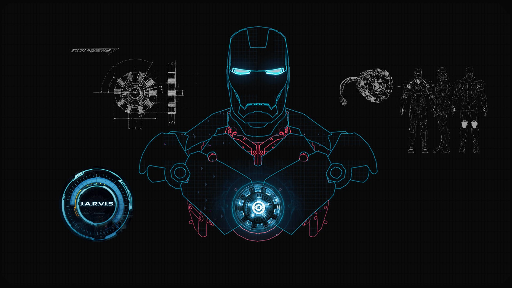

<p align="center">
  
</p>

<h1 align="center">🤖 JARVIS AI – Intelligent Virtual Assistant for Voice-Controlled Automation</h1>

<p align="center">
An AI-powered desktop assistant built with Python that combines voice interaction, intelligent automation, OpenAI integration, and productivity features into a single virtual assistant.
</p>

<p align="center">


</p>

---

# 📖 Project Overview

JARVIS AI is a Python-based intelligent virtual assistant designed to automate everyday desktop tasks through natural voice interaction. Inspired by modern AI assistants, it combines speech recognition, artificial intelligence, and desktop automation to create a seamless hands-free user experience.

The assistant can execute voice commands, retrieve real-time information, interact with web services, solve mathematical problems, automate desktop operations, and provide AI-powered responses through OpenAI integration.

This project demonstrates practical implementation of Artificial Intelligence, Natural Language Processing, Desktop Automation, and Human-Computer Interaction concepts.

---

# ✨ Features

- 🎙 Voice Command Recognition
- 🧠 AI-Powered Conversations (OpenAI Integration)
- 🔊 Text-to-Speech Responses
- 🌐 Web Search Automation
- 📚 Wikipedia Search
- 🌦 Weather Information
- 📰 Latest News Updates
- 🌍 Language Translation
- 💱 Currency Conversion
- 🧮 Mathematical Problem Solver
- 📋 Clipboard Utilities
- 💬 WhatsApp Messaging
- 📷 Camera Access
- 🖥 Desktop & System Automation
- 📂 File and Application Launcher
- 😂 Joke Generator
- ⏰ Productivity Utilities

---

# 🏗 System Architecture

```text
User Voice Command
        │
        ▼
Speech Recognition
        │
        ▼
Command Processing Engine
        │
 ┌──────┼───────────────┐
 │      │               │
 ▼      ▼               ▼
AI Module     Automation Module     Information Module
 │             │                    │
 ▼             ▼                    ▼
OpenAI     System Control      News / Weather /
API        Applications        Wikipedia / Translation
        │
        ▼
Text-to-Speech Response
```

---

# 🛠 Technologies Used

### Programming Language

- Python

### Artificial Intelligence

- OpenAI API
- Natural Language Processing

### Computer Vision

- OpenCV

### Speech Processing

- SpeechRecognition
- PyAudio
- pyttsx3

### Automation

- PyAutoGUI
- PyWhatKit
- Requests

### Additional Libraries

- Wikipedia API
- Google Translate
- SymPy
- Forex Python
- PyDictionary

---

# 📂 Project Structure

```text
jarvis-ai-assistant
│
├── assets/
│   ├── jarvis-banner.png
│   ├── home-screen.png
│   ├── voice-command.png
│   ├── ai-chat.png
│   ├── weather.png
│   ├── translation.png
│   ├── whatsapp.png
│
├── main.py
├── requirements.txt
├── README.md
├── LICENSE
└── .gitignore
```

---

# ⚙ Installation

Clone the repository

```bash
git clone https://github.com/Minal-Mirza016/jarvis-ai-assistant.git
```

Navigate into the project

```bash
cd jarvis-ai-assistant
```

Install dependencies

```bash
pip install -r requirements.txt
```

Run the assistant

```bash
python main.py
```

---

# 🚀 Future Improvements

- Local Large Language Model (LLM) Support
- Smart Home Integration
- Face Recognition Authentication
- Email Automation
- Calendar & Task Scheduling
- Mobile Companion Application
- Multi-language Voice Interaction
- Context-Aware Conversations
- Voice Biometrics
- Cloud Synchronization

---

# 🎯 Learning Outcomes

Through this project, I gained practical experience in:

- Artificial Intelligence
- Python Application Development
- Desktop Automation
- Speech Recognition
- OpenAI API Integration
- Human-Computer Interaction
- Natural Language Processing
- Software Engineering
- API Integration
- Testing & Debugging

---

# 👩‍💻 Author

**Minal Mirza**

BS Computer Science Graduate

Aspiring AI & Data Science Engineer

Passionate about Artificial Intelligence, Machine Learning, Computer Vision, Intelligent Automation, and Software Development.

💼 LinkedIn:
https://www.linkedin.com/in/minal-mirza-2582b3291/

---

# ⭐ If you found this project interesting, consider giving it a star!

---

# 📄 License

This project is licensed under the MIT License.
